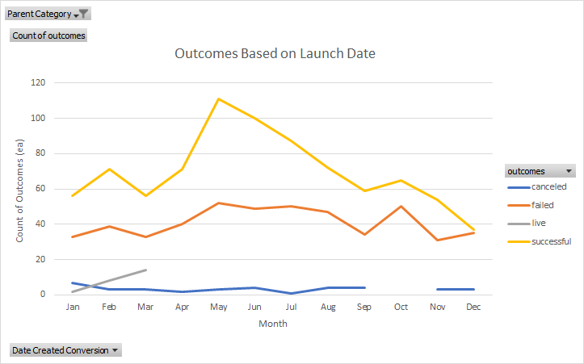
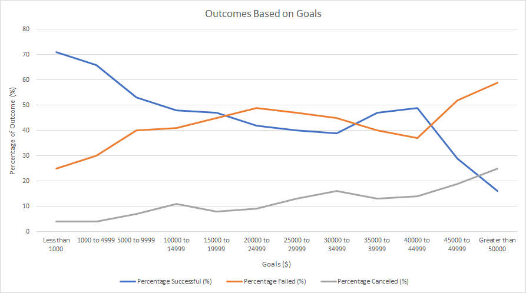

# kickstarter-analysis
Performing analysis on Kickstarter data to uncover trends

###Challenge 

Per background, Fever - A Workshop production was a play that reached 86% of its goal in 28 days. Its Kickstarter campaign failed but it expanded the question of whether the length of a campaign contributed to its ultimate success or failure. Through the analysis of the Kickstarter data, a number of observations could be gathered to measure the validity of this question and also to look at the outcomes of the data in relation to duration, goals, and launch dates. 

Taking Louise's campaign in mind, it could be deduced that the campaign did not reach its goal. When taking into consideration the duration of the campaign from its launch date to the deadline, a pivot table was created to find campaigns that "came close" (accounting for a range of 75% to 95% of its goal met) - to find that exactly 3 campaigns fit into the same outcome. Interestingly enough, they all fit within the time frame of 28-30 days (See pivot table in Outcomes Based on % Funded). This sets us up for some background to tackle whether the length of a campaign determines success or failure.

With this in mind, outcomes based on launch date was created.

Based on the results a few conclusions become apparent:
1) May/June theater Kickstarter campaigns succeed the most given the peak of successful campaigns during these months.
2) November/December campaigns do not fare well. This is based on the fact the line graph's success trend decreases slope significantly and the failed trend line increases. 
3) If a Kickstarter campaign is started in October, it has a higher chance of failure in comparison to all other months. Next highest likely month is May, but in proportion to successful campaigns the percentage of failure is more pronounced in October. 

Outcome based on goals show that not only the outcome is affected by duration but by goals and if they are attained as well. Looking at the line graph of the trend, the following points could be observed:

1) Campaigns whose goals were greater than $50,000 had a high percentage of not succeeding. At this point in the graph, percentage of success was at an all time low and percentage of failure and cancellation at a pronounced high. 
2) A similar deduction could be found of campaigns whose goals are less than $1000. Success rates are at an all time high and failure and cancellation rates are at an all time low. This concludes that goals can be met quickly when they are this low and very rarely met when set to greater than $50,000. 
3) Generally, percentage of successes decreases as the goal increases and percentage of failure/cancellations increase as goal amounts increase. A portion of the data also suggests that once campaigns enter the range of $15,000 to $30,000 there can be a higher percentage of failure that is outside of this general rule. 
4) Similarly, the data shows that a Kickstarter campaign can be successful even when the goal is set up to $45,000. Could this be due to the specific months of the year the campaigns were launched at? 

The question of whether the length of a campaign contributes to success or failure is a more complex one. Even analyzing our general trends for these two graphs, the Fever play campaign's goal was $2885 and $2485 were pledged. If the fact that the campaign was launched June 13th was added it indicates this campaign was in the optimal goal and launch date range to meet its goal (but it still did not happen, why is that?). Questions like these could uncover trends and formulate more questions along the way and in turn create more ways to look at a specific set of data differently. 

In conclusion, even though the Fever play was not successful it important to look at the Kickstarter data set and draw further conclusions that could add to campaign success. Finally, it is beneficial to obtain these trends to be able to see not only how Louise's play fares but also how to properly set up future Kickstarter campaigns for success. 
